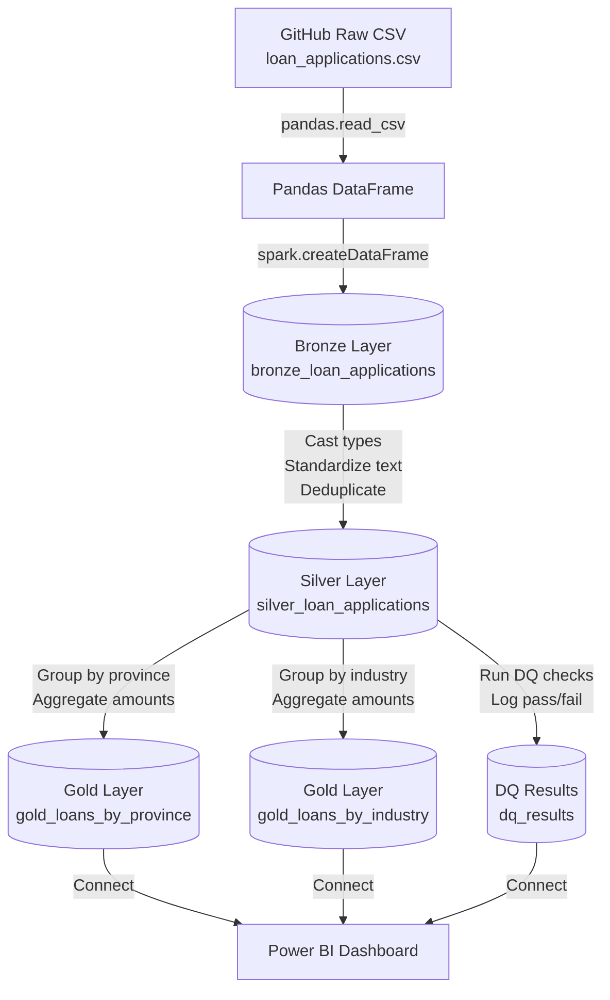

# Data Lineage / Traçabilité des données

## Pipeline Overview

---

## Layer Descriptions

| Layer | Table | Description |
|---|---|---|
| Source | loan_applications.csv | Raw CSV hosted on GitHub |
| Bronze | bronze_loan_applications | Raw data as-is, with metadata columns added |
| Silver | silver_loan_applications | Cleaned, typed, deduplicated data |
| Gold | gold_loans_by_province | Aggregated loan metrics by Canadian province |
| Gold | gold_loans_by_industry | Aggregated loan metrics by industry sector |
| DQ | dq_results | Data quality check results with pass/fail status |

---

## Notebook Lineage

| Notebook | Input | Output | Description |
|---|---|---|---|
| `01_medallion_pipeline` | loan_applications.csv (GitHub) | bronze_loan_applications, silver_loan_applications, gold_loans_by_province, gold_loans_by_industry | Full medallion pipeline |
| `02_data_quality` | silver_loan_applications | dq_results | Data quality framework |

---

## Field-Level Lineage Summary

loan_applications.csv
└── loan_amount
└── bronze_loan_applications.loan_amount (string)
└── silver_loan_applications.loan_amount (decimal 15,2)
├── gold_loans_by_province.avg_loan_amount
├── gold_loans_by_province.total_loan_volume
└── gold_loans_by_industry.avg_loan_amountloan_applications.csv
└── loan_amount
└── bronze_loan_applications.loan_amount (string)
└── silver_loan_applications.loan_amount (decimal 15,2)
├── gold_loans_by_province.avg_loan_amount
├── gold_loans_by_province.total_loan_volume
└── gold_loans_by_industry.avg_loan_amount
└── credit_score
        └── bronze_loan_applications.credit_score (double)
                └── silver_loan_applications.credit_score (integer)
                        └── gold_loans_by_industry.avg_credit_score

└── status
        └── bronze_loan_applications.status (string)
                └── silver_loan_applications.status (string)
                        ├── gold_loans_by_province.approved
                        ├── gold_loans_by_province.rejected
                        └── gold_loans_by_province.under_review

---

## Tools & Technologies

| Component | Tool |
|---|---|
| Source data | GitHub (raw CSV) |
| Pipeline orchestration | Databricks Serverless |
| Data processing | PySpark / Spark SQL |
| Storage format | Delta Lake |
| Version control | GitHub |
| Dashboard | Power BI |